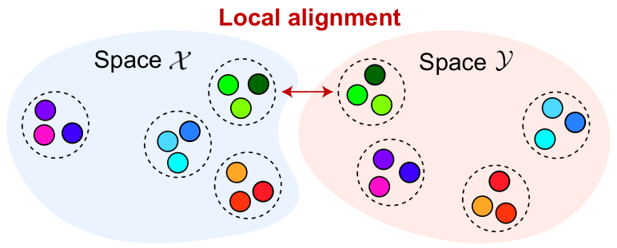
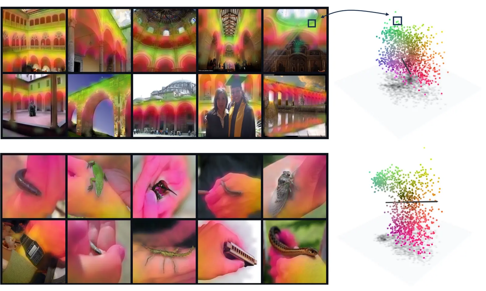
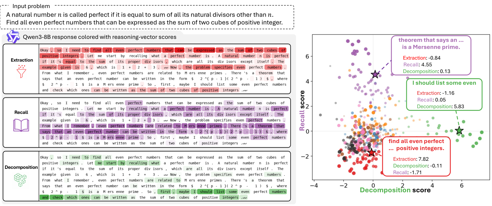
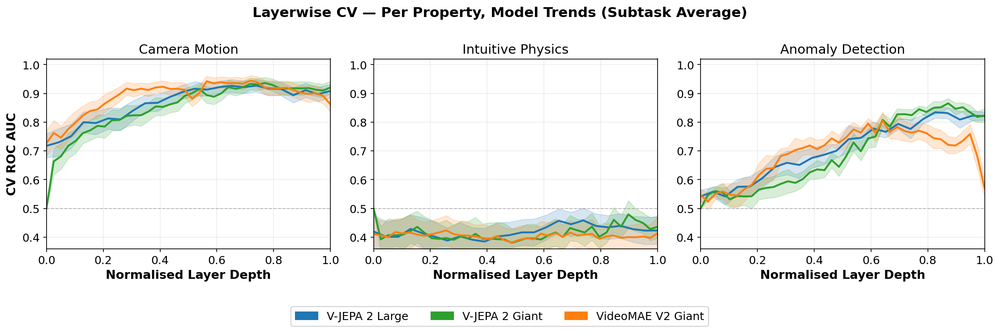
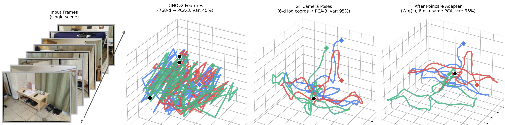
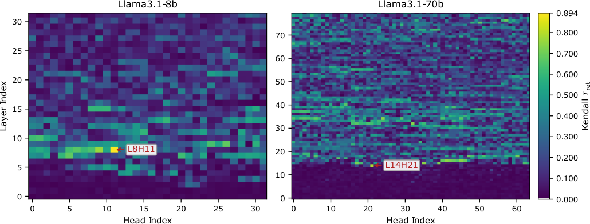
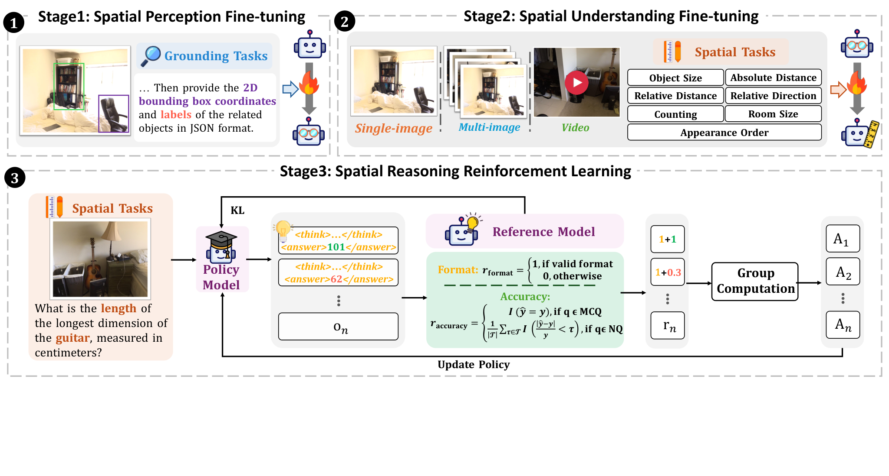

# Interpretability and Neural Geometry Reading List

This companion to the [main reading list](README.md) brings together its five interpretability entries and five additional papers on video, 3D space, multimodal spatial representations, spatial-reasoning training, and long-context memory. Each entry includes a figure from the original paper or post for a quick first impression.

## Entries from the README

### [Revisiting the Platonic Representation Hypothesis: An Aristotelian View](https://arxiv.org/abs/2602.14486)

Gröger et al., 2026 · ICML paper. Shows that model width and depth can inflate representation-similarity scores; after calibration, apparent global convergence largely disappears while cross-modal local-neighborhood agreement remains.

*Figure 1 illustrates the paper's local-alignment hypothesis. [Original figure](https://arxiv.org/html/2602.14486v2/null-cali-v8.png).*

### [The World Inside Neural Networks](https://www.goodfire.com/research/the-world-inside-neural-networks)

Geiger et al., May 7, 2026 · Research essay. Introduces neural geometry and shows how following curved representation manifolds can make interventions in a model more precise.

- **My take:** Activation space contains curved manifolds. Linear approximations remain useful, which helps explain why the linear representation hypothesis, sparse autoencoders, and simple additive steering can work, but their success has limits. To understand and control activations more reliably, we need to know when those approximations hold. Degradation at large steering strengths can also be viewed through this lens.
- **Assessment and follow-up:** This essay mostly synthesizes ideas from earlier papers, so its novelty seems limited for now. It works well as an introduction; follow Goodfire's later work for new methods.

*The post's illustration connects world structure, training data, and neural representations. [Original figure](https://static.goodfire.ai/neural-geometry-agenda/world-data-neural-networks.webp).*

### [Uncovering Neural Geometry in Vision Models With Block-Sparse Featurizers](https://www.goodfire.com/research/bsf-vision)

Fel et al., July 7, 2026 · Research article. Introduces block-sparse featurizers to find multidimensional concepts in vision-model activations and use them for fine-grained steering.

*Example feature blocks connect image regions to locations in a learned subspace. [Original figure](https://static.goodfire.ai/bsf-vision/arches-hands.webp).*

### [Modular Cognitive Architecture Emerges in Large Language Models](https://pengrui-han.github.io/LLM_Modularity_Page/)

Han et al., 2026 · Preprint and project page. Uses attribution patching across 46 language, formal, physical, and social reasoning tasks, then neuron ablations, to study functional specialization in LLMs.

*Figure 1 lays out the task domains, contrastive examples, and attribution pipeline. [Original figure](https://pengrui-han.github.io/LLM_Modularity_Page/assets/figures/figure1_overview.png).*

### [Beneath the Surface of Chains-of-Thought: A Mechanistic Interpretation of Reasoning Operations in LLMs](https://arxiv.org/abs/2609.04753)

Jeong et al., September 2026 · EMNLP paper. Studies how labeled reasoning operations appear in hidden representations of chain-of-thought traces; finds the clearest separation in middle layers and tests how prior context shapes these signals.

*Figure 1 shows how operation vectors score parts of a reasoning trace. [Original figure](https://arxiv.org/html/2609.04753v1/teaser.png).*

## Additional papers

### [What, Where, and How: Probing Spatiotemporal Representations in Video Foundation Models](https://arxiv.org/abs/2609.01551)

Musa et al., September 2026 · Paper. Probes V-JEPA 2 and VideoMAE-v2 layer by layer for camera motion, intuitive physics, and anomaly detection. Camera motion is strongly decodable in middle-to-later layers, while the tested intuitive-physics probes stay near chance. The authors also examine trajectories of video features and use spline-based latent steering to interpolate camera motion.

*Figure 3 compares probe performance across layer depth for the three properties. [Original figure](https://arxiv.org/html/2609.01551v1/figures/layerwise_plots/B1_per_property_avg_cv.png).*

### [SeeSE3: Emergence of 3D Space in Vision Features](https://arxiv.org/abs/2607.14228)

Chen et al., July 2026 · Paper. Tests whether vision-feature geometry reflects 3D camera motion in static scenes. The authors compare neighborhoods in feature and pose space, then train a Poincaré Adapter to recover camera-motion geometry from latent displacements; they use the resulting structure for latent-space visual odometry and localization.

*Figure 1 contrasts tangled raw features with camera-pose trajectories and adapted features. [Original figure](https://arxiv.org/html/2607.14228v1/figures/teaser_v2.png).*

### [S-Space: Exploring Spatial Workspace in Multimodal Models](https://mirros.ai/report/s-space.pdf)

MirroS, September 2026 · Technical report ([interactive post](https://mirros.ai/blog/s-space)). Studies an internal spatial subspace in vision-language models: linear readouts from object-token activations track viewer-centered horizontal, vertical, and distance coordinates. Interventions on these coordinates change spatial judgments, and an external coordinate transformation can outperform the model's own perspective-taking answers.

*Figure 2 sketches the proposed spatial workspace and earlier 2D evidence. [Original figure](https://mirros.ai/media/research/s-space/figure-02/figure-02.svg).*

### [Temporal Context Reinstatement Drives Episodic-Like Order Memory in Long-Context Language Models](https://arxiv.org/abs/2607.22575)

Pink et al., 2026 · ICML paper. Tests whether long-context LLMs can judge which of two passages came first and compares their distance effect with human order memory. Mechanistic analyses identify a one-dimensional temporal code reinstated at retrieval by a particular attention head; removing that direction weakens order judgments.

*Figure 4 maps retrieval-phase temporal information across attention heads and highlights the identified heads. [Original figure](https://arxiv.org/html/2607.22575v1/retrieval-temporal-information.png).*

### [SpatialLadder: Progressive Training for Spatial Reasoning in Vision-Language Models](https://arxiv.org/pdf/2510.08531)

Li et al., October 2025 · Paper. Introduces SpatialLadder-26k, a 26,610-example dataset spanning object localization and spatial tasks using single images, multiple views, and video. Its three-stage training recipe first grounds objects, then teaches spatial relationships, and finally uses reinforcement learning with verifiable rewards for more complex reasoning. The authors report improved spatial-benchmark performance for their 3B-parameter model.

*Figure 3 diagrams the progressive training framework. [Original figure](https://arxiv.org/html/2510.08531v1/framework.png).*
