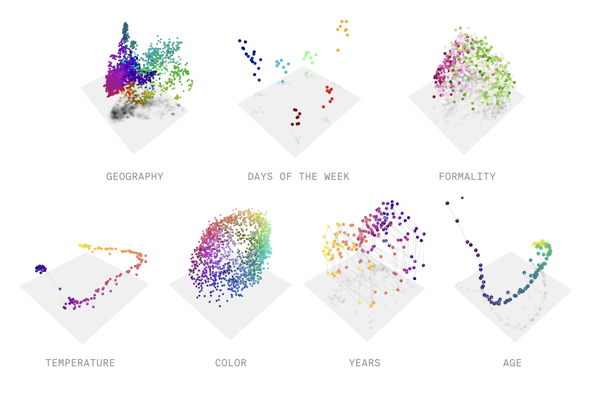
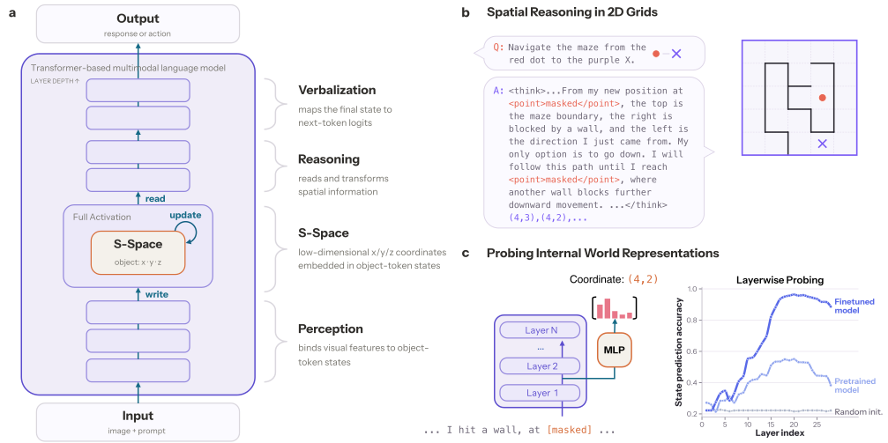
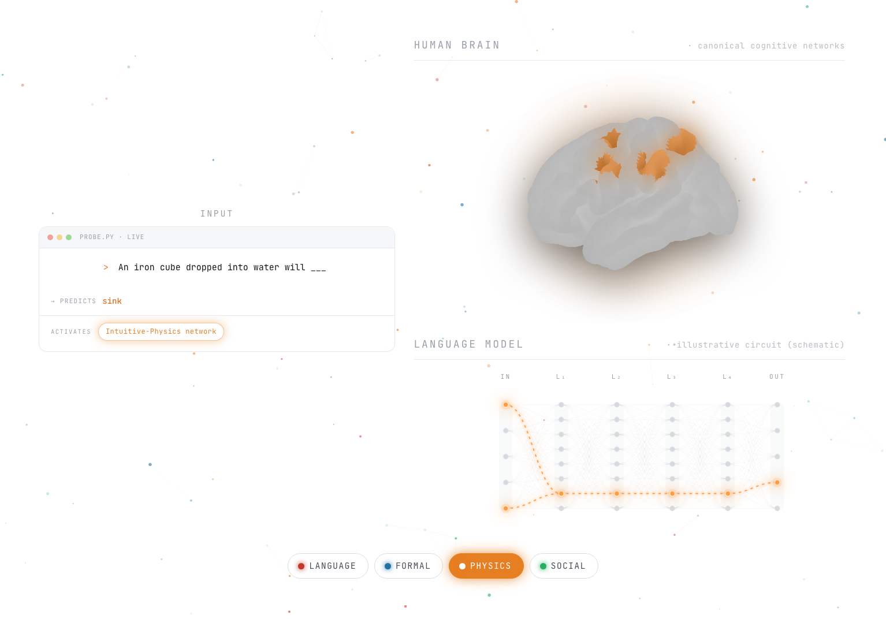
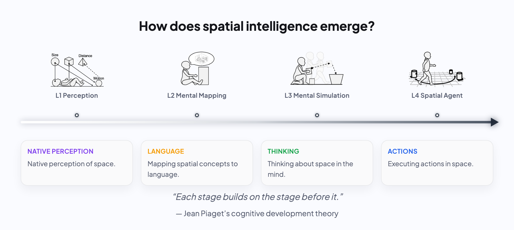

# Interpretability and Neural Geometry

A visual reading list on how models represent space, time, concepts, and reasoning. Selected entries include a short takeaway and a figure from the original paper or post. Select a figure to see the original at full size.

[Back to the main reading list](README.md)

## [The World Inside Neural Networks](https://www.goodfire.com/research/the-world-inside-neural-networks)

*Geiger et al., May 7, 2026 · Research essay*

Introduces neural geometry and shows how following curved representation manifolds can make interventions in a model more precise.

   
  <em>Examples of geometric structure in model representations.</em> · <a href="https://static.goodfire.ai/neural-geometry-agenda/neural-geometry-opengraph.webp">Original figure</a>

> **Reading note.** Activation space contains curved manifolds. Linear approximations remain useful, which helps explain why the linear representation hypothesis, sparse autoencoders, and simple additive steering can work, but their success has limits. To understand and control activations more reliably, we need to know when those approximations hold. Degradation at large steering strengths can also be viewed through this lens.
>
> **Follow-up.** This essay mostly synthesizes ideas from earlier papers, so its novelty seems limited for now. It works well as an introduction; follow Goodfire's later work for new methods.

## Interpreting Spatial Representations in VLM

### [S-Space: Exploring Spatial Workspace in Multimodal Models](https://mirros.ai/report/s-space.pdf)

*MirroS, September 2026 · Technical report ([interactive post](https://mirros.ai/blog/s-space))*

Studies an internal spatial subspace in vision-language models: linear readouts from object-token activations track viewer-centered horizontal, vertical, and distance coordinates. Interventions on these coordinates change spatial judgments, and an external coordinate transformation can outperform the model's own perspective-taking answers.

   
  <em>The proposed spatial workspace and earlier evidence from 2D grid worlds.</em> · <a href="https://mirros.ai/media/research/s-space/figure-02/figure-02.svg">Original figure</a>

- [What, Where, and How: Probing Spatiotemporal Representations in Video Foundation Models](https://arxiv.org/abs/2609.01551)
- [SeeSE3: Emergence of 3D Space in Vision Features](https://arxiv.org/abs/2607.14228)
- [Uncovering Neural Geometry in Vision Models With Block-Sparse Featurizers](https://www.goodfire.com/research/bsf-vision)
- [Linear Mechanisms for Spatiotemporal Reasoning in Vision Language Models](https://arxiv.org/abs/2601.12626)
- [Beyond Semantics: Rediscovering Spatial Awareness in Vision-Language Models](https://arxiv.org/abs/2503.17349)

## Cognitive Science Inspired Spatial Reasoning Analysis

### [Modular Cognitive Architecture Emerges in Large Language Models](https://pengrui-han.github.io/LLM_Modularity_Page/)

*Han et al., 2026 · Preprint and project page*

Uses attribution patching across 46 language, formal, physical, and social reasoning tasks, then neuron ablations, to study functional specialization in LLMs.

   
  <em>Within-domain neuron ablations affect accuracy more than cross-domain ablations.</em> · <a href="https://pengrui-han.github.io/LLM_Modularity_Page/assets/figures/ablation_within_vs_across_3bar.png">Original figure</a>

### [SpatialTree: How Spatial Abilities Branch Out in MLLMs](https://arxiv.org/pdf/2512.20617)

*Xiao et al., December 2025 (revised January 2026) · Preprint*

Proposes a cognitive-science-inspired hierarchy of multimodal-model spatial abilities, from perception and mental mapping to simulation and agentic competence, and evaluates 27 sub-abilities. The authors analyze how skills correlate and transfer under targeted fine-tuning; they also find that extended reasoning can hurt basic perceptual judgments.

   
  <em>SpatialTree's four-level hierarchy of spatial abilities.</em> · <a href="https://arxiv.org/html/2512.20617v2/x1.png">Original figure</a>

## Other Interesting Recent Works on Interpretability

- [Beneath the Surface of Chains-of-Thought: A Mechanistic Interpretation of Reasoning Operations in LLMs](https://arxiv.org/abs/2609.04753)
- [Temporal Context Reinstatement Drives Episodic-Like Order Memory in Long-Context Language Models](https://arxiv.org/abs/2607.22575)
- [Revisiting the Platonic Representation Hypothesis: An Aristotelian View](https://arxiv.org/abs/2602.14486)
- [Does Object Binding Naturally Emerge in Large Pretrained Vision Transformers?](https://arxiv.org/abs/2510.24709)
- [The Geometry of Reasoning: Flowing Logics in Representation Space](https://arxiv.org/abs/2510.09782)
- [Mixing Mechanisms: How Language Models Retrieve Bound Entities In-Context](https://arxiv.org/abs/2510.06182)
- [From Tokens to Lattices: Emergent Lattice Structures in Language Models](https://arxiv.org/abs/2504.08778)
- [Talking Heads: Understanding Inter-layer Communication in Transformer Language Models](https://arxiv.org/abs/2406.09519)
